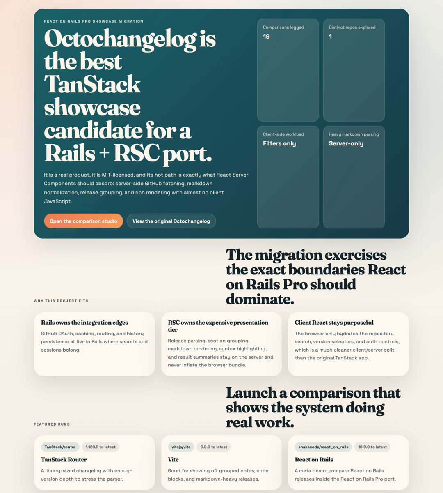
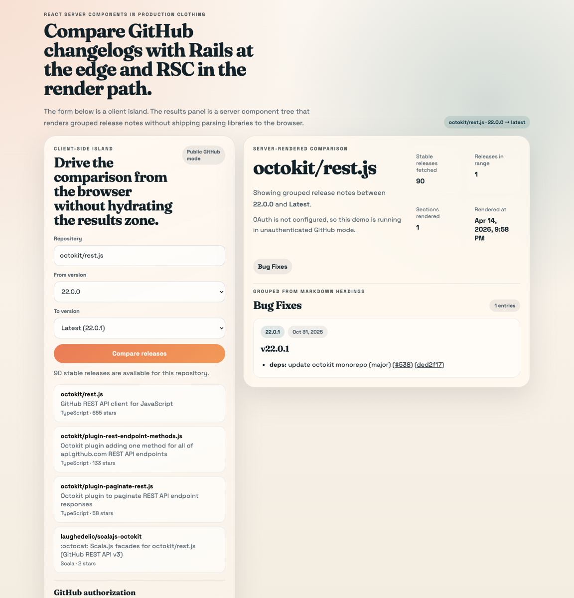

# React on Rails Demo: Octochangelog on Rails Pro

This repository is a full Rails + React on Rails Pro + React Server Components migration of
[Octochangelog](https://github.com/Belco90/octochangelog), one of the TanStack showcase projects.

The point of the demo is not just to "port a React app to Rails." The point is to show a
specific shape that React on Rails Pro handles well:

- Rails owns routes, sessions, OAuth callbacks, persistence, and HTML entrypoints.
- React Server Components stream the expensive comparison results.
- Only a thin client island hydrates in the browser for search and version selection.
- Markdown parsing, release grouping, and syntax highlighting stay on the server.

## What This Repo Proves

This demo is useful when you want to show that React on Rails Pro can:

- keep Rails in charge of request orchestration instead of pushing everything into a JavaScript router
- use React 19 + RSC for data-heavy, server-heavy pages without giving up Rails conventions
- keep the client surface intentionally small while still delivering a rich React UI
- handle real external API work, not just toy todo-list interactions
- support a clean server/client split on a page that obviously benefits from it

It is a good fit for demos, technical evaluation, and positioning conversations with teams that:

- already like Rails and do not want to give up Rails ownership of auth, sessions, routing, and caching
- want React for richer UI surfaces without committing every page to an SPA model
- are comparing Rails + RSC against Next.js, Inertia, or a larger client-rendered React surface

## Why Octochangelog

Octochangelog was the strongest TanStack showcase candidate because it is:

- a real product instead of a starter template
- MIT licensed, so the migration can stand on its own
- naturally server-heavy: GitHub fetches, markdown parsing, changelog grouping, and rich rendering
- a clean example of a page where the browser only needs control-surface interactivity

## Docs

- [Current Status](docs/current-status.md)
- [Demo Guide](docs/demo-guide.md)
- [Positioning Notes](docs/positioning-notes.md)
- [Performance Notes](docs/performance-notes.md)

## Live Demo

- Public deployment: not configured yet
- Local demo after boot: [http://127.0.0.1:3000](http://127.0.0.1:3000)

## Screenshots

| Home route | Compare route |
| --- | --- |
|  |  |

## Quick Start

### Prerequisites

- Ruby `3.4.6`
- Node.js `24`
- `npm`
- SQLite 3

### Install and Run

```bash
bundle install
npm install
bin/rails db:prepare
bin/rails react_on_rails:generate_packs
bin/shakapacker
```

Run the app in two terminals:

```bash
bundle exec rails s -p 3000
RENDERER_PORT=3800 node client/node-renderer.js
```

Then open [http://127.0.0.1:3000](http://127.0.0.1:3000).

If you use `overmind`, `bin/dev` is also available.

### Optional GitHub OAuth

For higher GitHub API limits, set these in `.env`:

```bash
GITHUB_CLIENT_ID=...
GITHUB_CLIENT_SECRET=...
```

Without them, the app still works against public GitHub data.

## Useful Development Commands

```bash
bin/dev
bin/shakapacker
bin/rails react_on_rails:generate_packs
script/benchmark_demo.sh
bin/rubocop
bin/brakeman --no-pager
bin/bundler-audit
bin/rails test
```

## Routes

- `/` renders the marketing-style landing page and recent comparison history
- `/compare` renders the compare surface and streams the RSC results panel
- `/rsc_payload/:component_name` is the React on Rails Pro RSC transport route
- `/api/github/repositories` provides repository search results for the client island
- `/api/github/releases` provides stable release options for the client island
- `/auth/github` and `/auth/github/callback` handle optional GitHub OAuth

## Architecture

### Request Flow

1. A normal Rails route hits `HomeController` or `CompareController`.
2. Rails prepares props, reads session state, and handles GitHub preflight work.
3. The `.erb` view calls `stream_react_component(...)` for the RSC surface.
4. React on Rails Pro serves the initial shell and streams the RSC payload through `/rsc_payload/:component_name`.
5. The Node renderer executes `rsc-bundle.js`, resolves async server components, and streams the rendered tree back.
6. Only the filter UI hydrates as a client island.

### Key Rails Pieces

- `app/controllers/compare_controller.rb` owns comparison orchestration and persisted history
- `app/controllers/github_auth_controller.rb` owns the OAuth redirect and callback flow
- `app/controllers/api/github_controller.rb` serves JSON endpoints for the client island
- `app/services/github/client.rb` wraps GitHub REST calls, caching, token exchange, and version filtering
- `app/models/comparison_run.rb` stores recent compare requests

### Key React Pieces

- `app/javascript/src/octochangelog/ror_components/` contains top-level components registered with React on Rails Pro
- `app/javascript/src/octochangelog/components/CompareFilters.tsx` is the standalone client island
- `app/javascript/src/octochangelog/components/CompareResults.tsx` is the streamed async server component
- `app/javascript/src/octochangelog/lib/` contains formatting helpers and shared types
- `client/node-renderer.js` configures the React on Rails Pro Node renderer

## Key RSC Patterns

### 1. Rails Starts the Stream

The compare page is still a normal Rails route plus a normal Rails view:

```erb
<%= stream_react_component("OctochangelogCompareResultsPage", props: @compare_results_props) %>
```

That keeps routing, sessions, redirects, and response semantics in Rails.

### 2. The Client Surface Is Explicitly Small

The compare form is mounted separately as a non-prerendered React island:

```erb
<%= react_component("CompareFiltersStandalone", props: @compare_filters_props, prerender: false) %>
```

Repository search, release selection, and auth entrypoints hydrate in the browser. The results zone does not.

### 3. The Expensive Rendering Work Stays on the Server

`CompareResults.tsx` parses markdown, groups changelog sections, applies GitHub-flavored markdown transforms,
and renders the final grouped release output on the server. Those parsing libraries do not need to ship to the browser.

### 4. Rails Still Owns Stateful Concerns

OAuth session state, comparison history, and API caching all stay in Rails. This is not a JavaScript app
that happens to sit next to Rails. Rails remains the application shell.

## Why This Demo Is Useful

This repo is strongest as evidence for pages that are:

- data-heavy
- externally sourced or expensive to assemble
- naturally split between server-rendered content and small interactive controls
- better served by keeping routing, auth, and persistence in Rails

Concretely, it gives a credible answer for surfaces like:

- release notes and changelog explorers
- reports and dashboards with small interactive filters
- documentation or knowledge pages with rich server-rendered content
- search or comparison pages that need real React controls without a full SPA ownership model

## Performance Snapshot

These numbers are local development measurements from April 15, 2026 in unauthenticated GitHub mode.
They are useful as a demo baseline, not as a universal production claim.

- warmed `/`: ~31-40 ms total on a representative local sample
- warmed `/compare?repo=octokit/rest.js&from=22.0.0&to=latest`: ~356-431 ms total
- first compare request after boot or cache miss: ~0.75 s on a representative sample run
- `public/packs/js/generated/CompareFiltersStandalone.js`: 1,918 bytes
- `public/packs/js/client0.js`: 22,012 bytes
- `public/packs/js/generated/OctochangelogCompareResultsPage.js`: 1,643 bytes
- `public/packs/css/application.css`: 13,648 bytes

Interpretation:

- the landing page is effectively Rails-fast after warmup
- the compare page pays for real GitHub I/O plus markdown parsing and grouped rendering
- the interactive island stays small
- the heavy release-note processing remains on the server instead of inflating browser JavaScript

See [Performance Notes](docs/performance-notes.md) for methodology and rerun commands via `script/benchmark_demo.sh`.

## Comparison with the Original Octochangelog Shape

| Concern | Original App Shape | This Repo |
| --- | --- | --- |
| Routing | Application-owned React routing | Rails routes and controllers |
| Auth/session work | JavaScript app concerns | Rails session and OAuth callback flow |
| Comparison rendering | React app surface | Rails entrypoint plus streamed RSC results |
| Heavy markdown work | Client-capable app logic | Server-side RSC render path |
| Persisted history | App concern | Rails model and database record |
| Client JavaScript | Larger app-owned surface | Thin client island plus shared runtime |

The important similarity is that both deliver a modern React UI.
The important difference is ownership: Rails remains the request orchestrator and stateful shell.

## How This Complements Other ShakaCode RSC Repos

- [`shakacode/gumroad-rsc`](https://github.com/shakacode/gumroad-rsc) is a broader product-code experiment inside an existing application. This repo is the cleaner showcase-migration story: smaller setup, faster to explain, and easier to demo live.
- [`shakacode/react_on_rails-hacker-news-app`](https://github.com/shakacode/react_on_rails-hacker-news-app) proves a multi-route content app with feeds, item pages, nested comments, and Rails-managed caching. This repo proves a different page shape: external API fetches, a very small client island, and heavy server-side rendering on one obviously RSC-friendly surface.
- Together, the three repos cover distinct proof points: product experiment, content app, and focused showcase migration.

## Verification

Verified locally:

- `script/benchmark_demo.sh`
- `bin/shakapacker`
- `bin/rubocop`
- `bin/brakeman --no-pager`
- `bin/bundler-audit`
- `bin/rails test`

Verified on GitHub Actions:

- `lint`
- `scan_ruby`
- `test`

## See Also

- [shakacode/gumroad-rsc](https://github.com/shakacode/gumroad-rsc)
- [shakacode/react_on_rails-hacker-news-app](https://github.com/shakacode/react_on_rails-hacker-news-app)

## Attribution

The product concept and comparison flow are adapted from
[Belco90/octochangelog](https://github.com/Belco90/octochangelog), which is distributed under the MIT license.
This repository is a Rails + React on Rails Pro reimplementation of that idea and keeps the original project credited here and in the license setup.

## License

This repository is distributed under the MIT License. See [`LICENSE`](LICENSE).
